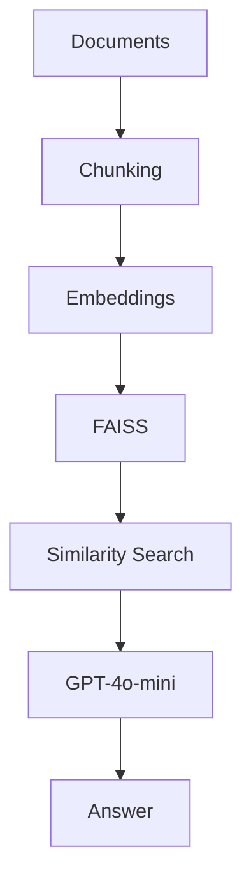

# RFP Intelligence System (RAG) 📄🤖

  

## Table of Contents

- Project Overview
- Objectives
- Architecture
- Data Processing Pipeline
- Retrieval Layer
- Generation Layer
- Evaluation
- Deployment
- Tech Stack
- Repository Structure
- How to Run

| Component | Technology |
|------------|------------|
| Backend | FastAPI |
| LLM | GPT-4o-mini |
| Embeddings | BAAI/bge-small-en-v1.5 |
| Vector DB | FAISS |
| Framework | LangChain |

Documents
 ↓ 
Chunking
 ↓ 
Embeddings
 ↓ 
FAISS
 ↓ 
Similarity Search
 ↓ 
GPT-4o-mini
 ↓ 
Response

