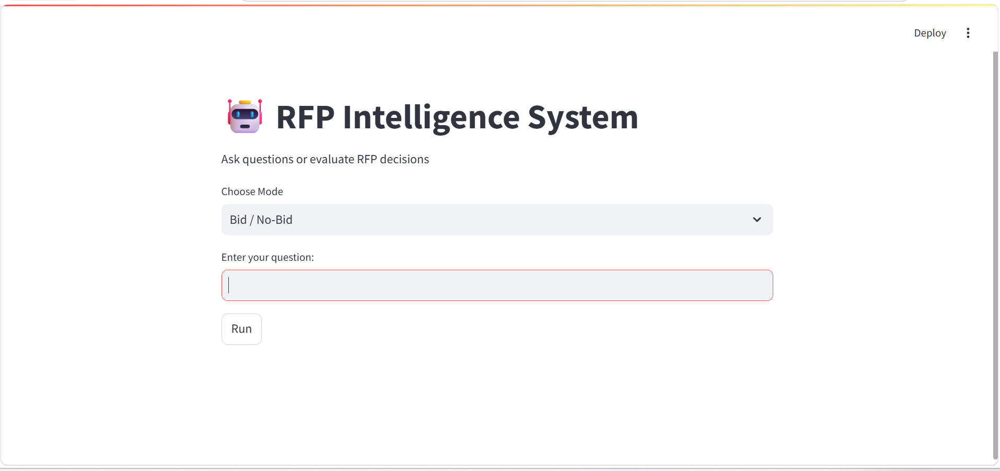

# RFP Intelligence System



## Overview

RFP Intelligence System is an AI-powered application that helps users analyze Request for Proposal (RFP) documents using Retrieval-Augmented Generation (RAG).

The system allows users to:

* Ask questions about RFP documents
* Retrieve relevant information from multiple files
* View source documents used to generate answers
* Receive basic Bid / No-Bid recommendations

---

## Project Architecture

The system follows a Retrieval-Augmented Generation (RAG) workflow:

Documents (PDF / DOCX / XLSX)

↓

Document Loading

↓

Chunking

↓

Embeddings Generation

↓

FAISS Vector Database

↓

Similarity Search

↓

Context Retrieval

↓

GPT-4o-mini

↓

Generated Response

↓

Streamlit User Interface

---

## Technologies Used

### Programming Language

* Python

### AI & Machine Learning

* OpenAI GPT-4o-mini
* LangChain
* HuggingFace Embeddings
* BAAI/bge-small-en-v1.5

### Vector Database

* FAISS

### Backend

* FastAPI

### Frontend

* Streamlit

---

## Features

### Q&A Mode

Users can ask questions such as:

* What technical requirements are mentioned?
* What qualifications are required?
* What deliverables are expected?
* What is the submission deadline?

### Bid / No-Bid Mode

Provides a basic recommendation based on the retrieved document content.

---

## Project Structure

```text
rfp_intelligence_system/

├── app.py
├── main.py
├── rag_chain.py
├── bid_decision.py
├── requirements.txt
├── faiss_index/
├── documents/
└── README.md
```

## Installation

### 1. Create Virtual Environment

```bash
python -m venv .venv
```

### 2. Activate Virtual Environment

Windows:

```bash
.venv\Scripts\activate
```

### 3. Install Dependencies

```bash
pip install -r requirements.txt
```

### 4. Configure Environment Variables

Create a `.env` file and add:

```env
OPENAI_API_KEY=your_api_key
```

---

## Running the Backend

```bash
uvicorn main:app --reload
```

The API will run on:

```text
http://127.0.0.1:8000
```

---

## Running the Frontend

Open a new terminal:

```bash
streamlit run app.py
```

The application will run on:

```text
http://localhost:8501
```

---

## MVP Scope

The project includes:

* Document ingestion
* Text extraction
* Chunking
* Embeddings generation
* FAISS vector database
* Semantic retrieval
* LLM response generation
* Question answering
* Basic Bid / No-Bid analysis
* Streamlit frontend
* FastAPI backend

---

## Future Improvements

* Advanced Bid / No-Bid scoring
* Confidence scores
* Azure deployment
* Authentication and user management
* Improved retrieval ranking
* Analytics dashboard
* Enterprise integrations

---
## Prepared By

**Cady Almutairi**  
AI Bootcamp Project
